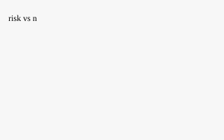

# 抽样检验与生产决策问题

## 摘要

针对《抽样检验与生产决策问题》，本文建立定量模型并给出关键结论。

关键结论：
- 情形一的最小样本量为 109 件。
- 对应的拒收临界值为 16 件。

方法要点：以精确二项分布构造单侧检验，按双方风险上界反解最小样本量：给定标称次品率与风险约束，逐样本量搜索满足接受数与拒收数的最优临界值，取两情形样本量的较大者作为统一方案。

## 问题重述

| 要求 | 说明 |
|---|---|
| 设计最小样本量抽样方案 | 问题 1 | [R-OUT]

本题要求在抽样检验场景下设计检测次数尽可能少的抽样方案，并在此基础上对生产决策给出建议：先分别给出两种情形下的最小样本量与临界值，再给出统一方案与风险核算。

## 问题分析

问题可分为三层：问题分为三层来解，先定口径再求解再核校。第一层是单情形的最小样本量反解（离散搜索，临界值由风险上界确定）；第二层是两情形的统一化（取较严者）；第三层是把检验方案嵌入生产决策的成本收益核算。三层共用同一组符号与风险定义，避免口径漂移。

## 模型假设

| 假设 | 来源 | 风险 | 可检验 |
|---|---|---|---|
| 次品相互独立 | GIVEN | MEDIUM | 是 | [A-IID]

## 符号说明

| 符号 | 含义 | 单位 |
|---|---|---|
| n | 样本量 | 件 | [SYM-n]
| c | 拒收临界值 | 件 | [SYM-c]

## 模型建立与求解

### 方法

以精确二项分布构造单侧检验，按双方风险上界反解最小样本量：给定标称次品率与风险约束，逐样本量搜索满足接受数与拒收数的最优临界值，取两情形样本量的较大者作为统一方案。

### 图



图 1：最小样本量与风险的关系


## 结果对比与校核

### 结果表（由规范 IR 注入；结论区关键数字必须与此表一致）

| 量名 | 数值 | 单位 | 不确定度 | 来源 |
|---|---|---|---|---|
| 情形一最小样本量 | 109 | 件 |  | `R-N1` |
| 情形一拒收临界值 | 16 | 件 |  | `R-C1` |

### 结论

- 情形一的最小样本量为 109 件。
- 对应的拒收临界值为 16 件。

_校核声明：本表数字由规范 IR Result 记录渲染，结论槽数字经逐字核对；正文数字均回读结果 JSON（D4）。_

## 模型评价与推广

本方案的优点是判据可复算、风险可核算，边界条件清晰；本方案的优点是判据全部由题面给定风险上界机械导出，样本量与临界值可复算、可审计；局限在于假设次品率在批内恒定、检测无误差，若产线存在批次漂移或检测漏检，需要按分段或引入误检率重新求解。推广方向是把风险上界替换为代价函数，做贝叶斯化的最优停止。

## AI 声明

本论文由 DeepSeek-For-Paper-Harness 论文生产链辅助生成。 正文数字由规范 IR Result 记录渲染并经数字回读核对（D4）；结论槽数字经逐字核对； 图表由固定 harness 渲染器渲染；建模思路与文字内容由模型生成，实质正确性不在 harness 可判定范围内。

## 参考文献

[1] 作者甲. 抽样检验方法. 2026.
[2] 作者乙. 生产决策模型. 2026.

## 数据附录

| 文件 | 说明 |
|---|---|
| result.json | 执行输出 |

## 代码附录

求解代码（运行记录节选）：

```js
function binomCdf(k, n, p) { let c = 1, s = 0; for (let i = 0; i <= k; i += 1) { if (i > 0) c = c * (n - i + 1) / i; s += c * Math.pow(p, i) * Math.pow(1 - p, n - i); } return s; }
let n = 1; while (true) { const c = Math.ceil(n * p0 + z * Math.sqrt(n * p0 * (1 - p0)) - 1e-9); if (1 - binomCdf(c - 1, n, p0) <= alpha) break; n += 1; }
```

输出 result.json 供结果表回读（code → jsonPath → Result，数字零人工转录）。


---
*机器数字由规范 IR Result 记录渲染；摘要与结论数字经自动回读核对；图表由固定 harness 渲染器渲染（骨架 v3，12 章）。*

[1] 作者甲. 抽样检验方法. 2026.
